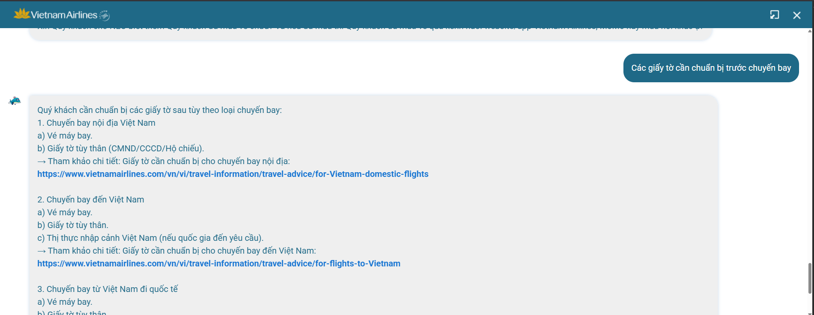
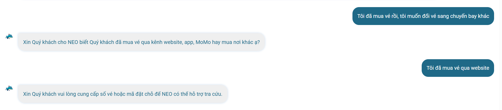
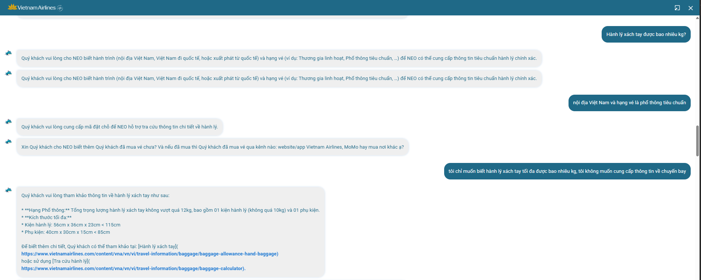
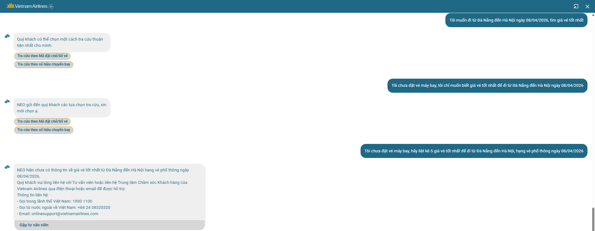
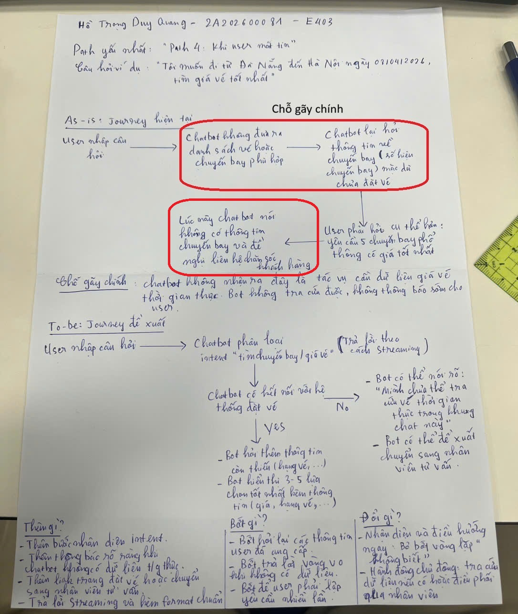

# UX Exercise
- **Student Name**: Hồ Trọng Duy Quang
- **Student ID**: 2A202600081
- **Date**: 08/04/2026

 

# Sản phẩm AI: VN Airlines - Chatbot NEO
## Phần 1 - Khám phá:
- Marketing:
    - Có khả năng tra cứu thông tin vé máy bay, chuyến bay.
    - Tìm giá vé tốt nhất hỗ trợ khách hàng.
    - Thông tin hành lý.
    - Hướng dẫn làm thủ tục và các giấy tờ cần chuẩn bị trước chuyến bay.
    - Với những câu hỏi Out-of-domain, chatbot sẽ giới hạn câu trả lời trong phạm vi dịch vụ hàng không.
    - Với những câu hỏi NEO chưa thể giải đáp, hành khách sẽ được chuyển hướng gặp tư vấn viên.

- Thực tế so với marketing:
    - Chatbot xử lý khá tốt các câu hỏi dạng thông tin chung như giấy tờ cần chuẩn bị, quy định cơ bản, hoặc hướng dẫn thủ tục. Câu trả lời thường có cấu trúc rõ và có link tham khảo.
    - Với các câu hỏi cần thêm thông tin như đổi vé, chatbot biết hỏi lại để xác nhận mã đặt chỗ, kênh mua vé, hoặc thông tin liên quan. Đây là điểm tương đối khớp với marketing về hỗ trợ khách hàng.
    - Tuy nhiên, với các câu hỏi cần dữ liệu thời gian thực như "tìm giá vé tốt nhất", chatbot chưa thực sự đáp ứng đúng kỳ vọng. Bot không liệt kê được các chuyến bay cụ thể và cuối cùng chuyển hướng sang chăm sóc khách hàng.
    - Với câu hỏi về hành lý, bot đôi khi hỏi quá nhiều thông tin không cần thiết như mã đặt chỗ hoặc tình trạng đã mua vé, trong khi user chỉ hỏi quy định chung. Điều này làm trải nghiệm bị chậm và gây cảm giác bot không hiểu đúng nhu cầu.
    - Tính năng chuyển sang tư vấn viên có tồn tại, nhưng thường chỉ xuất hiện sau khi bot không trả lời được. Nếu bot nhận biết sớm hơn giới hạn của mình thì trải nghiệm sẽ tốt hơn.

## Phần 2 - Phân tích 4 paths:
### Path 1: Khi AI đúng
Câu hỏi ví dụ: "Các giấy tờ cần chuẩn bị trước chuyến bay"

User thấy gì
- Bot trả lời khá nhanh.
- Câu trả lời có cấu trúc rõ ràng.
- Có kèm đường link để người dùng tham khảo chi tiết hơn.
- Có gợi ý liên hệ thêm chăm sóc khách hàng để biết cụ thể hơn.

Hệ thống confirm thế nào
- Confirmation chủ yếu đến từ việc câu trả lời đúng ngữ cảnh và đúng nhu cầu.
- Nếu có link chính thức hoặc format rõ ràng thì câu trả lời đáng tin cậy hơn.

### Path 2: Khi AI không chắc
Câu hỏi ví dụ: "Tôi đã mua vé rồi, tôi muốn đổi vé sang chuyến bay khác"

Hệ thống thấy câu hỏi chưa đủ các thông tin cần thiết nên hỏi lại user để xác nhận thông tin:
- Hỏi lại đặt vé qua những kênh nào để hỗ trợ tốt nhất.
- Yêu cầu user cung cấp số vé hoặc mã đặt chỗ để hỗ trợ tra cứu đổi vé.

### Path 3: Khi AI sai
Câu hỏi ví dụ: "Hành lý xách tay được bao nhiêu kg?"

- Hệ thống hỏi hành trình đi của khách hàng và hạng vé để tra cứu đúng nhất.
- Nhưng khi user cung cấp thông tin thì chatbot lại hỏi mã đặt chỗ, hỏi user đã mua vé chưa, trong khi user chỉ cần biết hành lý xách tay tối đa hạng phổ thông được mang bao nhiêu kg.
- User phải xác định lại mong muốn của bản thân và yêu cầu không hỏi về thông tin chuyến bay, lúc này chatbot mới trả lời đúng.

### Path 4: Khi user mất tin
Câu hỏi ví dụ: "Tôi muốn đi từ Đà Nẵng đến Hà Nội ngày 08/04/2026, tìm giá vé tốt nhất"

- Hệ thống trả lời sai, không liệt kê các chuyến bay có giá vé tốt nhất cho người dùng mà lại hỏi thông tin về chuyến bay.
- Khi người dùng yêu cầu lại cung cấp 5 chuyến bay phổ thông có giá vé tốt nhất đi từ Đà Nẵng đến Hà Nội ngày 08/04/2026.
- Chatbot lúc này không tra cứu được thông tin về chuyến bay thì đưa ra phương án user có thể liên hệ chăm sóc khách hàng (con người).

### Phân tích
- Path sản phẩm xử lý tốt nhất là **Path 1 - Khi AI đúng**. Lý do là câu hỏi của user thuộc dạng thông tin chung, không cần dữ liệu cá nhân hoặc dữ liệu chuyến bay thời gian thực. Bot trả lời nhanh, đúng trọng tâm, trình bày rõ ràng và có link chính thức để user kiểm chứng thêm. Đây là path tạo cảm giác đáng tin nhất vì user không phải hỏi lại nhiều lần.

- Path xử lý tương đối ổn là **Path 2 - Khi AI không chắc**. Bot chưa trả lời ngay mà hỏi thêm thông tin để xác nhận, ví dụ kênh đặt vé hoặc mã đặt chỗ. Việc hỏi lại là hợp lý vì đổi vé là tác vụ phụ thuộc vào vé cụ thể. Tuy nhiên, bot nên giải thích rõ vì sao cần thông tin đó để user không cảm thấy bị hỏi thừa.

- Path yếu nhất là **Path 4 - Khi user mất tin**. Marketing nói chatbot có thể "tìm giá vé tốt nhất", nhưng khi user đưa đủ hành trình, ngày bay và yêu cầu tìm giá tốt nhất thì bot không cung cấp được danh sách chuyến bay cụ thể. Bot hỏi lại thông tin không cần thiết rồi mới nói nên liên hệ chăm sóc khách hàng. Điều này làm user mất tin vì lời hứa marketing và khả năng thực tế không khớp nhau.

- **Path 3 - Khi AI sai** cũng là một điểm yếu, nhưng vẫn có thể phục hồi vì sau khi user nói rõ lại nhu cầu thì bot trả lời đúng. Vấn đề chính ở Path 3 là bot chưa phân biệt tốt giữa câu hỏi quy định chung và câu hỏi cần tra cứu theo vé/chuyến bay cụ thể.

Kỳ vọng từ marketing **chỉ khớp một phần** với thực tế. Bot làm tốt ở các câu hỏi FAQ như giấy tờ, thủ tục, thông tin chung về hành lý và việc chuyển hướng sang tư vấn viên. Gap lớn nhất nằm ở các tác vụ có vẻ giống "tra cứu thật" như tìm giá vé tốt nhất hoặc danh sách chuyến bay. Nếu chatbot không có quyền truy cập dữ liệu giá vé thời gian thực, marketing nên nói rõ hơn, hoặc bot cần chuyển user sang công cụ đặt vé/tư vấn viên ngay từ đầu thay vì tạo kỳ vọng rằng nó có thể tự tìm giá tốt nhất.

## Phần 3 - Sketch "làm tốt hơn"
Chọn 1 path yếu nhất mà mình tìm được. Sketch trên giấy:

As-is (bên trái): user journey hiện tại → đánh dấu chỗ gãy
To-be (bên phải): user journey đề xuất → vẽ kế bên
Ghi rõ: thêm gì? Bớt gì? Đổi gì?

Path được chọn để sketch: **Path 4 - Khi user mất tin**.

### As-is: Journey hiện tại
1. User nhập: "Tôi muốn đi từ Đà Nẵng đến Hà Nội ngày 08/04/2026, tìm giá vé tốt nhất".
2. Chatbot không đưa ra danh sách vé hoặc chuyến bay phù hợp.
3. Chatbot hỏi lại thông tin về chuyến bay dù user đã cung cấp điểm đi, điểm đến và ngày bay.
4. User phải hỏi lại cụ thể hơn: yêu cầu 5 chuyến bay phổ thông có giá tốt nhất.
5. Chatbot nói không có thông tin chuyến bay và đề xuất liên hệ chăm sóc khách hàng.
6. User mất tin vì kỳ vọng ban đầu là bot có thể tìm giá vé tốt nhất.

Chỗ gãy chính: chatbot không nhận ra đây là tác vụ cần dữ liệu giá vé thời gian thực. Bot vừa không tra cứu được, vừa không báo sớm giới hạn của mình.

### To-be: Journey đề xuất
1. User nhập: "Tôi muốn đi từ Đà Nẵng đến Hà Nội ngày 08/04/2026, tìm giá vé tốt nhất".
2. Chatbot phân loại intent là **tìm chuyến bay/giá vé**.
3. Nếu bot có kết nối với hệ thống đặt vé:
    - Bot hỏi thêm thông tin còn thiếu, ví dụ số lượng hành khách, hạng vé, một chiều hay khứ hồi.
    - Bot hiển thị 3-5 lựa chọn giá tốt nhất, kèm giờ bay, hạng vé, điều kiện hành lý và nút/link đặt vé.
4. Nếu bot không có dữ liệu giá vé thời gian thực:
    - Bot nói rõ: "Mình chưa thể tra cứu giá vé thời gian thực trong khung chat này."
    - Bot đưa link sang trang tìm chuyến bay đã điền sẵn Đà Nẵng - Hà Nội - 08/04/2026 nếu có thể.
    - Bot đề xuất chuyển sang tư vấn viên ngay nếu user muốn được hỗ trợ trực tiếp.
5. User hiểu giới hạn của bot và vẫn có bước tiếp theo rõ ràng.

### Thêm gì?
- Thêm bước nhận diện intent "tìm giá vé tốt nhất".
- Thêm thông báo rõ ràng khi chatbot không có dữ liệu thời gian thực.
- Thêm link chuyển sang trang đặt vé hoặc chuyển sang tư vấn viên sớm hơn.
- Thêm format kết quả nếu có dữ liệu: giá, giờ bay, hạng vé, hành lý, điều kiện đổi/hủy.

### Bớt gì?
- Bớt hỏi lại các thông tin user đã cung cấp.
- Bớt trả lời vòng vo khi bot không có dữ liệu.
- Bớt để user phải lặp lại yêu cầu nhiều lần.

### Đổi gì?
- Đổi từ kiểu trả lời "không biết sau nhiều lượt chat" sang kiểu "nhận diện giới hạn và điều hướng ngay".
- Đổi từ chatbot chỉ phản hồi bị động sang chatbot hỗ trợ user đi tiếp: tra cứu nếu có dữ liệu, hoặc chuyển sang trang đặt vé/tư vấn viên nếu không có dữ liệu.
- Đổi wording để trung thực hơn với năng lực thật của hệ thống, tránh làm user nghĩ bot chắc chắn tìm được giá vé tốt nhất trong mọi trường hợp.

